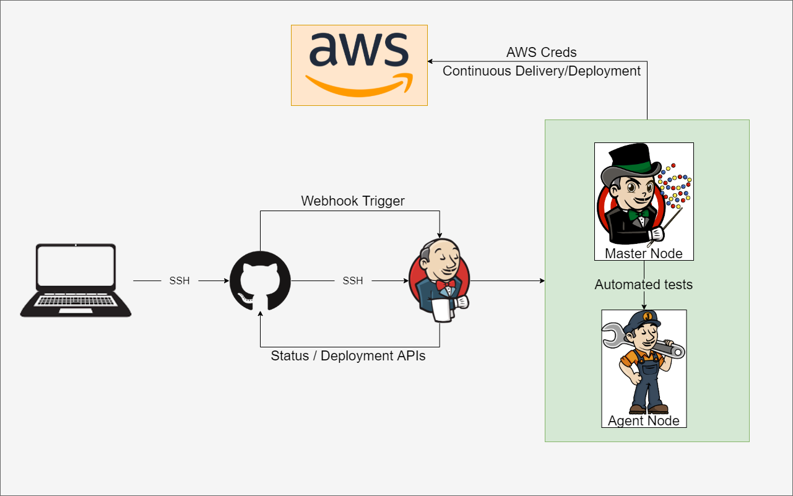
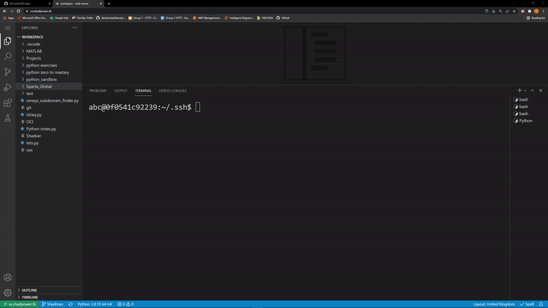
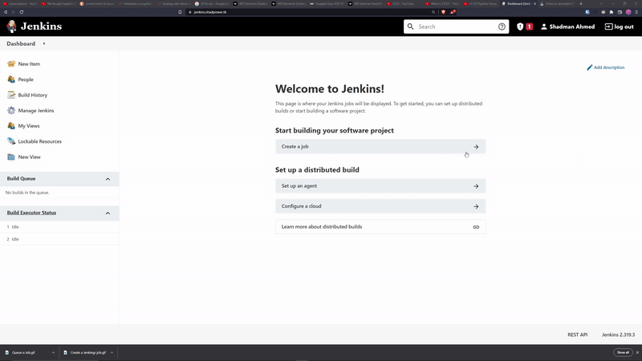
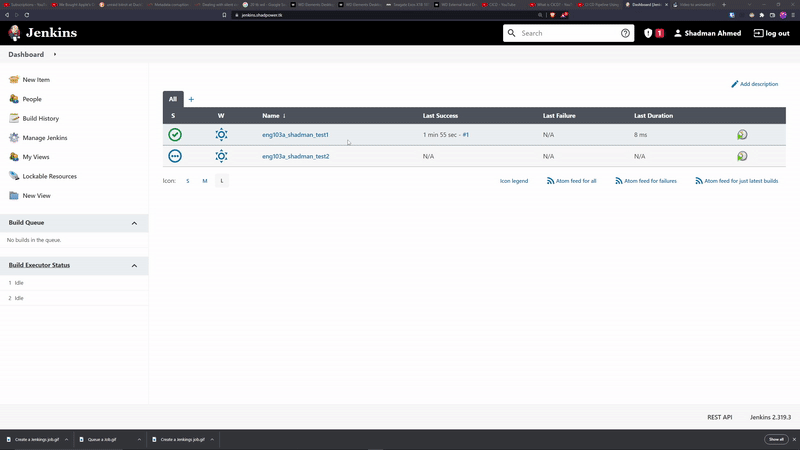

# Jenkins
Jenkins is a free and open source automation server. It helps automate the parts of software development related to building, testing, and deploying, facilitating continuous integration and continuous delivery.

## Setup SSH Keys with GitHub
- `ssh-keygen -t ed25519 -C "{your_email@example.com}"`
- `eval "$(ssh-agent -s)"`
- `ssh-add ~/.ssh/{ssh-key-name}`
- Go on Github settings and select **New SSH key** in the SSH and GPG keys section.
- Give it a name, and paste in the contents of the `.pub` key value pair.
  

## How to create a Jenkins job
- Can set retention rules
- set Job criteria
- 

## How to queue a job to an existing job
- Go to the first job, configure, and choose another build project in post-build actions.
- 
